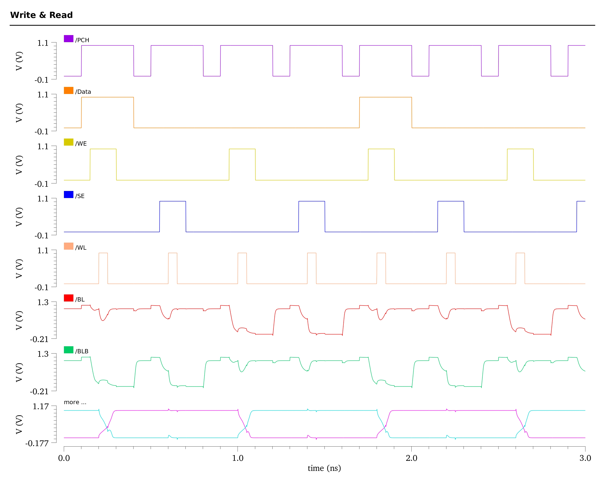

# Performance Analysis of 6T SRAM and Design of 4x4 Memory Array

## Overview
This project focuses on the performance analysis of a 6T SRAM cell and the design of a 4x4 memory array with peripheral circuits. The implementation is carried out in the *45 nm* technology node, ensuring efficient operation and scalability. The peripheral circuits include a sense amplifier, row decoder, precharge, and write driver circuit, which are essential for the functionality of the memory array.

## Key Features
- **6T SRAM Analysis:**
  - Evaluated critical performance parameters, including:
    - Read and write delay
    - DC power consumption
    - Static noise margins

- **4x4 Memory Array Design:**
  - Developed a compact and efficient 4x4 memory array.
  - Integrated peripheral circuits:
    - Sense amplifier
    - Row decoder
    - Precharge circuit
    - Write driver circuit

- **Technology Node:** *45 nm* in **Cadence Virtuoso**

## Methodology
1. **Performance Analysis:**
   - Simulated the 6T SRAM cell to determine read and write delay, DC power, and noise margins.
   - Conducted transient and steady-state simulations for accuracy.

2. **Memory Array Design:**
   - Designed and verified a 4x4 memory array with optimized layout.
   - Implemented peripheral circuits to support memory operations.

3. **Tools Used:**
   - **Cadence Virtuoso** for schematic entry, layout design, and simulation.
   - **MATLAB** scripts for data analysis and automation.

---

## Performance Analysis of 6T SRAM Cell

### Standard 6T SRAM Bitcell

The standard 6T SRAM bitcell comprises two CMOS inverters connected in a positive feedback loop, forming a bistable circuit for storing one bit of data ('1' or '0'). The bitcell includes:

- **Core Components:**
  - Two CMOS inverters connected in a positive feedback loop form a bistable circuit for stable data storage.
  - Two PMOS pull-up devices (M3, M5) and two NMOS pull-down devices (M4, M6) constitute the cross-coupled inverter pair.
  - Two NMOS pass-gate devices (M1, M2), controlled by the wordline (WL), act as switches connecting the inverters to the bitlines (BL, BLB).

- **Key Features:**
  - Data is stored as complementary values at internal nodes Q and QB.
  - The bitlines (BL, BLB) serve as data lines for reading from or writing to the bitcell.
  - Stored data is retained as long as power is supplied to the cell.

- **Operation:**
  - The cross-coupled inverter pair ensures the stability of the stored data ('1' or '0').
  - The wordline controls the pass-gates, enabling interaction with the bitlines for read and write operations.

---

###  Read Operation

#### Write Operation Steps

1. **Initial Conditions:** Internal storage nodes Q and QB are at '0' and '1', respectively.

2. **Precharging:** Bitlines (BL and BLB) are precharged to the supply voltage ($Vdd$) or an intermediate level (0 and Vdd).

3. **Wordline Activation:** The wordline (WL) is asserted high, enabling access to the bitcell.

4. **Discharging:** One side of the bitcell (holding '0') discharges its corresponding bitline through the pass-gate and pull-down transistors. If BLB discharges, the bitcell holds a logic '1'.

**Non-Destructive Read:**
   - The internal node holding '0' must not rise above the inverter trip-point to prevent a destructive read.
   - This is ensured by a **large enough** bitcell ratio $β$.

**Read time:**
   - Defined as: It is measured from the assertion of the Wordline to the point when the voltage difference on the bitlines is large enough for the sense amplifier to correctly detect and output the stored value.
   - From the above waveforms, the write time is calculated to be $30~ps$.

### Transistor Sizing for Successful Read:

**Bitcell Ratio (β):**
   - Defined as:

$$
\beta = \frac{W_4/L_4}{W_1/L_1} = \frac{W_6/L_6}{W_2/L_2}
$$
   - Typically varies from 1.25 to 2.5 based on application and desired static noise margin (SNM).

**Stability Trade-Offs:** 
   - Larger β provides higher SNM, faster read speed, and robustness but increases silicon area and leakage current.
   - Smaller β makes the bitcell compact for high-density cache designs but more susceptible to process variation failures.

---
   
### Write Operation

The write operation in an SRAM bitcell involves flipping the stored data. The following is the explanation for *writing "1"* logic into the SRAM which in turn emphasises the need for stronger access transistors

#### Write Operation Steps:

1. **Initial Conditions:** Internal nodes Q and QB are assumed to hold logic ‘0’ and ‘1’, respectively. Wordline (WL) is initially low ($WL = 0$).

2. **Data Placement:** The new data is placed on BL, and its complement on BLB. i.e BL is kept at $Vdd$ and BLB to 0

3. **Wordline Activation:** The wordline (WL) is asserted high and hence bit lines BL and BLB are connected to the SRAM cell through the access transistors M1 and M2.

4. **Node Flipping:**
   - Node QB is pulled below the trip point of inverter INV-1, initiating a feedback loop in the cross-coupled inverters.
   - As Q and QB flip states, WL is de-asserted ($WL = 0$).

**Write time:**
   - Defined as: The *write time* of an SRAM cell is calculated as the time from the assertion of the Wordline to the point where the internal node voltages intersect, indicating a successful flip of the stored value.
   - From the above waveforms, the write time is calculated to be $10~ps$.

### Transistor Sizing for Successful Write:

**Pull-Up Ratio (PR):**

$$
PR = \frac{W_3/L_3}{W_1/L_1} = \frac{W_5/L_5}{W_2/L_2}
$$

- PR determines the balance between pass-gate transistors (M1, M2) and pull-up transistors (M3, M5).
- A **lower PR value** ensures successful write operations by favoring stronger pass-gate transistors over pull-up transistors.

**Write Challenges**:
- **Pass-Gate vs. Pull-Up Transistors:**
  - During a write operation, there is a "fight" between the pass-gate and pull-up transistors.
  - For example, if writing a logic ‘0’ while the bitcell holds a logic ‘1’:
    - M1 must pull Q low (to ground).
    - M3 attempts to keep Q high (at Vdd).
    - M1 must overpower M3 for a successful write.

**Stability Trade-Offs:** 
   - Wider pass-gate transistors (lower PR) improve write success but reduce **Read SNM**, making the bitcell less stable during read operatons.

---

###  SRAM Cell DC Power

The **DC power** of an SRAM cell is calculated by analyzing the leakage currents flowing through the transistors in a steady-state (no read/write operations). It is primarily a function of the supply voltage ($V_{DD}$) and the total leakage current ($I_{leakage}$).

#### Formula:

$$
P_{DC} = V_{dd} \times I_{leakage}
$$

Where:
- $P_{DC}$ = DC power consumption (in watts)  
- $V_{dd}$ = Supply voltage (in volts)  
- $I_{leakage}$ = Total leakage current (in amperes) 

---

###  SRAM Cell Stabilty Metrics

### HOLD State and Hold SNM Measurement

The Hold Static Noise Margin (Hold SNM) quantifies the stability of an SRAM bitcell when it is in the hold state, i.e., when it retains its data without any active read or write operations. It is defined as the maximum amount of DC noise voltage that the bitcell can tolerate at the storage nodes ($Q$ and $QB$) while maintaining the stored value. A higher Hold SNM indicates greater stability and noise tolerance in the idle state.

**HOLD State Setup**
- **Wordline Deactivation**: $WL = 0$, turning off the access transistors $M_1$ and $M_2$.
- **Bitline Deactivation**: Both bitlines ($BL$ and $BLB$) are disconnected from the storage nodes, ensuring no interference during the hold state.
- **Storage Nodes**: The SRAM cell retains its data, with node $Q$ representing the stored bit.

**Hold SNM Measurement**
- The Hold VTC is measured by sweeping the voltage at the storage node $Q$ while monitoring the voltage at $QB$. The curve reflects how much noise the SRAM cell can tolerate before the stored data flips.

**Hold Noise Margin Squares**
- **Definition**: The hold noise margin square is the **largest square** that can fit between the $Q$ and $QB$ VTC curves during the hold state.
- **SNM Determination**:
  - Measure the side lengths of both noise margin squares corresponding to $Q$ and $QB$.
  - The **side of the smaller square** determines the **Hold SNM**, as it represents the bitcell's weakest tolerance to noise in the hold state.
  - From the above waveforms, the Read SNM is calculated to be $0.42~V$.

### READ State and Read SNM Measurement
The Read Static Noise Margin (Read SNM) quantifies the stability of an SRAM bitcell during a read operation. It is defined as the maximum DC noise voltage that the bitcell can tolerate while retaining its stored data. It provides a critical measure of the SRAM cell's robustness against noise during the read process.

**READ State Setup**
- **Wordline Activation**: $WL = 1$, enabling the access transistors $M_1$ and $M_2$.
- **Bitlines Activation**: Both bitlines ($BL$ and $BLB$) are biased at $Vdd$.

**Read SNM Measurement**
- During a read operation, the VTC plots for $Q$ and $QB$ are generated by sweeping the voltage at one storage node while monitoring the other.
- Due to process variations and transistor mismatches, the VTC curves may not be symmetric.

**Read Noise Margin Squares**
- **Definition**: The read noise margin square is the **largest square** that can fit between the $Q$ and $QB$ VTC curves.
- **Read SNM Determination**:
  - Measure the side lengths of both noise margin squares corresponding to $Q$ and $QB$.
  - The **side of smaller square** dictates the SRAM cell's **Read SNM**, as it represents the cell's weakest tolerance to noise.
  - From the above waveforms, the Read SNM is calculated to be $0.202~V$.

### WRITE State and Write SNM Measurement
The Write Static Noise Margin (WSNM) quantifies the ability of an SRAM bitcell to successfully write new data. It is defined as the maximum DC noise voltage that the SRAM cell can tolerate during the write operation while still allowing a correct write. The WSNM is an essential metric to assess the robustness of the bitcell against noise during a write operation.

**WRITE State Setup**
- **Wordline Activation**: $WL = 1$, enabling the access transistors $M_1$ and $M_2$.
- **Bitlines Activation**: Bitlines ($BL$ and $BLB$) are driven to appropriate values for writing the new data to the SRAM cell.
  - For a write "0", $BL$ is pulled low and $BLB$ is pulled high.
  - For a write "1", $BL$ is pulled high and $BLB$ is pulled low.

**Write SNM Measurement**
- During a write operation, the VTC plots for $Q$ and $QB$ are generated by sweeping the voltage at one storage node while monitoring the other, similar to the read state.
- The write process, however, involves a significant change in the state of the bitcell, and the VTCs can shift significantly.

**Write Noise Margin Squares**
- **Definition**: The write noise margin square is the **smallest square** that can fit between the $Q$ and $QB$ VTC curves under the write condition.
- **Write SNM Determination**:
  - The **side of smaller square** dictates the SRAM cell's **Write SNM**, as it represents the cell's weakest tolerance to noise during the write operation, ensuring the integrity of the written data.
  - From the above waveforms, the Write SNM is calculated to be $0.34~V$.

The calculation for fitting the largest square and the plotting code for HSNM, RSNM and WSNM measurement are available in the [**SNM_Measurements_MATLAB**](./SNM_Measurements_MATLAB/).

---

###  Read and Write Operation of 4X4 SRAM Array cell

#### **Peripheral Circuits Involved**
1. **Precharge Circuit**: Precharges the bitlines to $V_{DD}$ before every read/write cycle.
2. **Sense Amplifier**: Amplifies small differential signals during the read operation.
3. **Write Driver**: Drives the bitlines during the write operation to overwrite the stored value.
4. **Row Decoder**: Activates the appropriate wordline ($WL$) for the selected cell.

During these operations, all peripheral circuits perform their designated functions seamlessly to ensure proper operation.

The graph illustrates consecutive **read** and **write operations** in an SRAM cell, specifically:
1. **Write 1 → Read 1**: Writing logic '1' to the cell, followed by reading the stored value ('1').
2. **Write 0 → Read 0**: Writing logic '0' to the cell, followed by reading the stored value ('0').

#### **Write Operation**
- **Behavior**:
  - The storage nodes $Q$ and $QB$ transition such that one node is pulled to $V_{DD}$ (logic '1') and the other to $V_{SS}$ (logic '0').
  - This change is driven by the **write driver** and controlled by the **wordline (WL)** and **bitlines (BL, BLB)**.
  
#### **Read Operation**
- **Behavior**:
  - The bitlines are pre-charged to $V_{dd}$ before the read cycle.
  - The wordline activates the **access transistors**, and the small voltage difference is amplified by the **sense amplifier** to determine the stored value.
  - The storage nodes $Q$ and $QB$ maintain their voltages, ensuring data stability.

---

## Conclusion

In this document, we have explored various aspects of SRAM cell design, operation, and analysis, focusing on parameters like Static Noise Margin (SNM), Read and Write operations, and DC power consumption. Through understanding the behavior of the SRAM cell during read and write cycles, as well as the role of peripheral circuits such as precharge circuits, sense amplifiers, and write drivers, we gain valuable insights into the robustness and performance of SRAMs in modern applications.

The analysis of **Read SNM** and **Write SNM** serves as a key method to evaluate the stability of the SRAM bitcell under different operating conditions. We also discussed the significance of DC power consumption in evaluating SRAM efficiency, especially in terms of voltage and temperature variations.

By leveraging simulations and measurements, we can further refine SRAM designs to optimize power consumption, noise immunity, and reliability. These design considerations are critical for creating efficient and robust memory systems for high-performance computing, mobile devices, and other integrated circuits. 

Overall, understanding and improving SRAM cell performance remains essential for advancing modern semiconductor technologies.

---

## References

1. Jawar Singh, Saraju P. Mohanty, and Dhiraj K. Pradhan, "Robust SRAM Designs and Analysis", [Journal/Conference Name], .

2. B. Razavi, "Design of Analog CMOS Integrated Circuits", McGraw-Hill.

3. P. E. Allen and D. R. Holberg, "CMOS Analog Circuit Design", Oxford University Press.

4. A. J. Annema, J. M. Rabaey, and B. J. M. Van Lintel, "Low Power Design Techniques for SRAMs", IEEE Journal of Solid-State Circuits, vol. 35, no. 10, pp. 1442-1446.

5. S. K. Gupta, K. K. Parhi, and S. G. Nair, "Power Optimization in SRAM Design Using Low Power Techniques", IEEE Transactions on VLSI Systems, vol. 16, no. 12, pp. 1485-1494.

---